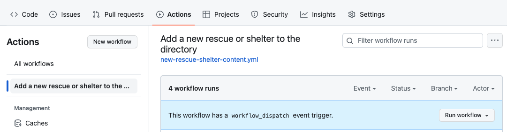
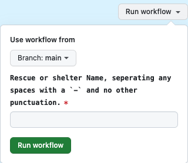

+++
title = 'Github Action to Create New Content in Hugo'
date = 2024-01-19T21:54:43-08:00
# draft = true
showToc = true
tags = [
    "Hugo",
    "GitHub Actions",
    "CI/CD",
    "Static Site Generator",
    "Automation",
    "GitHub Pages",
    "Workflow Dispatch",
    "Content Management",
    "Web Development",
    "DevOps"
]
homeFeatureIcon = "fa-brands fa-github"
+++



I am using [Hugo](https://www.gohugo.io) for some of the websites I have made, and I think it is pretty great. The one problem with it for many non-technical people I work with is that there is no CMS feature, they want a website administration page where they can do the usual. There are some open source headless CMS systems built for Hugo out there, but I have not had the chance to explore them yet and I don't like throwing a client on new software just to decide I don't like it in a few months, so I wanted to do something automated, but avoid having to install vscode, git, ssh-keys and etc in order to make simple edits I decided to do something with [GitHub actions](https://github.com/features/actions).


<!--more-->

Github actions have been around since around 2020 and they added a lot of bang to the CI/CD side of GitHub's offering. For this project specifically I was already using a github action to build my hugo website, and deploy it to the free [Github Pages](https://pages.github.com/) hosting. Looking at the `hugo.yaml` file for that action, I realized it was just making calls to the `hugo` executable in a container to build and deploy my site, so I thought why not try to do a new workflow that runs the `hugo new content` command. Here is my workflow file -

```yaml
name: Add a new rescue or shelter to the directory
on:
  workflow_dispatch:
    inputs:
      shelterName:
        description: "Rescue or shelter Name, seperating any spaces with a `-` and no other punctuation."
        required: true
jobs:
  build:
    runs-on: ubuntu-latest
    steps:
      # Checks-out your repository under $GITHUB_WORKSPACE, so your job can access it
      - uses: actions/checkout@v3
        with:
          ref: "main"
      - name: Setup hugo
        uses: peaceiris/actions-hugo@v2
        with:
          hugo-version: "0.121.1"
      - name: Create New Rescue or Shelter directory
        run: |
          CONTENT = ${{ github.event.inputs.shelterName }}
          NO_SPACES = ${CONTENT// /-}
          echo $NO_SPACES
          hugo new content rescue-shelter-directory/$NO_SPACES/index.md
      - name: Add, commit, and push
        uses: actions4git/add-commit-push@v1.0.0
        with:
          commit-message: "Automated Changes occured. Added new content rescue-shelter-directory/${{ github.event.inputs.shelterName }}/index.md"
```

The purpose of this is the allow the user to go to the actions tab for their repository and run this action to create a new listing in the animal shelter directory.

### workflow_dispatch

First you will notice a different `on:` than you may be used to seeing -

```yaml
on:
  workflow_dispatch:
    inputs:
      shelterName:
        description: "Rescue or shelter Name, seperating any spaces with a `-` and no other punctuation."
        required: true
```

After the action completes setting up hugo and checking out the repository, it is ready to create your new content.

The `workflow_dispatch` creates a button in the github ui that enables the action to run vs the usual run on commit or merge from a PR. 

Clicking on the button opens the form you configured in `workflow_dispatch` in a popup window. 


The user just enters the name of the new directory in the form field `shelterName`, and the github action takes that and stitches into the hugo new command like so -

```yaml
run: |
  CONTENT = ${{ github.event.inputs.shelterName }}
  NO_SPACES = ${CONTENT// /-}
  echo $NO_SPACES
  hugo new content rescue-shelter-directory/$NO_SPACES/index.md
```

The `|` right after `run:` allows your command to be spread over multiple lines. So what this does, is replaces any spaces with a `-`, then runs `hugo new content` on the rescue-shelter-directory content directory (which already existed in this Hugo project, but Hugo would create it).

To learn more about `workflow_dispatch` you can read up on it in the [release notes](https://github.blog/changelog/2020-07-06-github-actions-manual-triggers-with-workflow_dispatch/).

### add-commit

Finally, the workflow commits the code back to the repo using [the add-commit github action](https://github.com/marketplace/actions/add-commit#about-tokens). Keep in mind you will need to go into your github settings for the action to commit to the repo.

### Editing and deploying this content

At this point, the user is done with github actions. In my cheat sheet I provide them with, they have a link to their content directory in github, so they don't get lost. They can then go directly to the code and edit the markdown file, I like to keep `default=true` in the archetype, so they will at least need to remove that.

Once they click save, the file is saved and commited back to the branch. Depending on your CI this could be the last step, as saving/commiting the changed content file will publish to the github pages site and be live immediately (well, reasonably immediately -- as soon as deploy runs which usually takes a minute or 2).

### Later down the line

To improve on this, I may add more archetypes to allow for more custom content to be created, or perhaps I will just use the [Cloud Cannon headless CMS for hugo](https://cloudcannon.com/).

They have a nice write-up on the power of archetyptes as well - [Use a nicer archetype](https://cloudcannon.com/blog/maximizing-the-convenience-factor-archetypes-in-hugo/)
