+++
title = 'The Towers I Loved, and the Day They Fell'
date = 2026-09-11T00:00:00-07:00
slug = 'the-towers-i-loved-and-the-day-they-fell'
description = "Twenty-five years after September 11, Ben Strawbridge remembers watching the attacks from his Lower Manhattan rooftop and shares photographs of the World Trade Center before and during that day."
summary = "Twenty-five years after September 11, 2001, I remember watching the attacks from the roof of my Lower Manhattan apartment, and reflect on how that morning changed my view of the world."
tags = [
  "september-11",
  "new-york-city",
  "world-trade-center",
  "photography",
  "personal-history"
]
hideAsideBar = true
homeFeatureIcon = "fa-solid fa-camera"
og_image = "wtc_sunset_2000_soft.jpg"
# Same photograph as the page header, as the card's lead image. cardType picks
# layouts/partials/card-image.html (resolved per page by utils/card-type.html)
# wherever this page is listed; cardImage names the page-bundle resource.
cardType = "-image"
cardImage = "wtc_sunset_2000_soft.jpg"
cardImageAlt = "The World Trade Center towers on the Lower Manhattan skyline at twilight, 2000"
# The header photograph is set through the theme's headerBackgroundImage param
# rather than a Tailwind `bg-[url(...)]` class: that param emits an inline
# background-image style, so the header cannot silently lose its image if the
# JIT pass does not see this front matter. Only utilities already in use
# site-wide are listed on the inner frame.
[twClasses]
  headerBackgroundImage = "/images/header-bg/wtc-sunset-2000.jpg"
  headerBackgroundFrameInner = "bg-cover bg-center h-[200px] sm:h-[250px]"
+++

> Twenty-five years after September 11, 2001, I remember watching the attacks from the roof of my Lower Manhattan apartment, and reflect on how that morning changed my view of the world.

<!--more-->

*This essay is based on a spoken recollection recorded 25 years after the attacks. Memory does not preserve every minute perfectly. I have clarified the sequence where possible while leaving the substance of what I remember unchanged.*

Twenty-five years later, I still keep a folder of these photographs on my phone. I look at them occasionally to remind myself that what I witnessed really happened.

On the morning of September 11, 2001, I was living in New York City at the corner of First Avenue and 10th Street. It was a workday, but it was also an alternate-side parking day, so I went outside to move my car.

It was around nine that morning, and I knew I was late. As I headed toward my car near St. Mark's Place, between First Avenue and Avenue A, I saw two police officers sprinting up the street.

I called out to them: "What's going on?"

They looked at me as though I had somehow missed the obvious. One of them pointed downtown.

I turned and saw an enormous column of smoke rising from the World Trade Center.

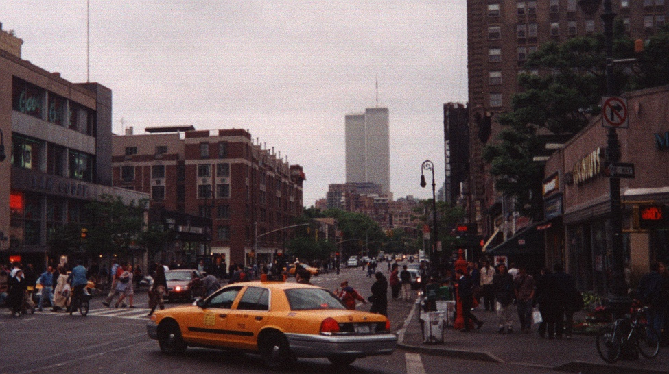

The first plane had already struck the North Tower. I had not turned on the television that morning, so I knew nothing about what was happening. Even as I looked at the smoke, I still could not understand what I was seeing.

I abandoned the idea of moving the car. I assumed every police officer in the city would soon be occupied with whatever was happening downtown, and parking enforcement was no longer going to matter.

I ran back to my apartment and turned on the news.

## From the Roof

My apartment building was about six stories tall, and I had access to the roof. At that time, there was no taller building immediately behind it, so I had a clear view toward the World Trade Center.

The September 11 photographs in this essay were taken from that roof.

My memory of the exact minutes has blurred over the years. I remember reaching the roof while the North Tower was already burning, and I remember seeing the second plane strike the South Tower. The established timeline places that impact at 9:03 a.m.

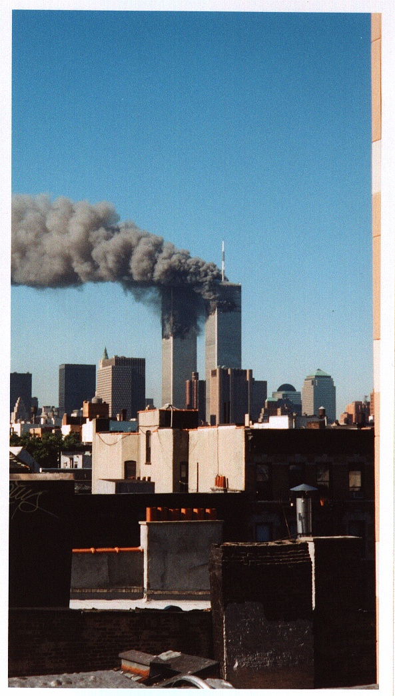

Later, at 9:59 a.m., I watched the South Tower collapse. Although it had been struck second, it was the first of the two towers to fall.

Smoke billowed into the sky and drifted east toward Brooklyn. People from my building gathered on the roof, all of us trying to comprehend what was happening in front of us.

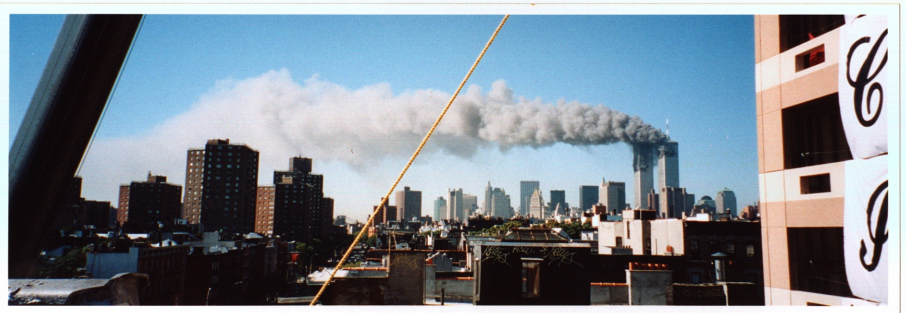

My wife had already left for work in Midtown. This was before cell phones (for us) and I had no way to contact her. I knew she was well north of the World Trade Center, which gave me some comfort, but I did not know exactly where she was or what she was doing.

I stayed on the roof and continued taking photographs.

One especially surreal moment has remained with me. A young woman was on the roof. I did not know her and assumed she lived in the building or knew someone who did.

When the South Tower collapsed, she began jumping up and down and shouting something like, "Death to capitalism."

She seemed thrilled.

I do not think she had connected what she was celebrating with the number of people who might have been inside that building. I had nothing to say.

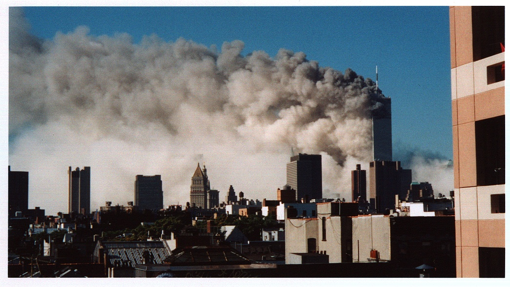

After the tower fell, I was in shock. I was crying. I went back down to my apartment, sat in front of the television and watched the news.

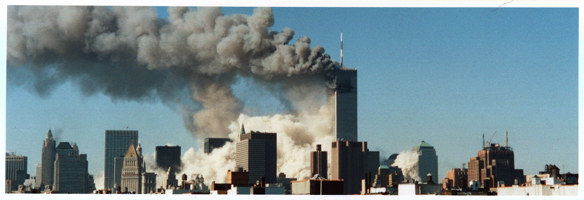

I remember watching footage of President George W. Bush, who had been visiting a classroom when he learned what was happening. I remember thinking that he appeared to be trying not to frighten the children around him.

The entire day felt unreal.

Eventually, my wife came home. We hugged and tried to understand what had happened.

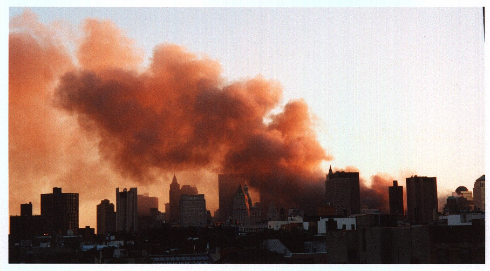

## The Weeks Afterward

The following weeks were a kind of madness.

I remember having to show identification to enter the area below 14th Street. Because we lived there, I could walk downtown and see the missing-person posters covering walls, fences and lampposts.

The posters still carried hope. Families and friends were searching for people who had worked in the towers, not yet ready to accept that they might be gone.

I watched the rubble and the people working around the site.

It was an extraordinarily intense time, and I still remember it vividly.

## The World That Followed

September 11 changed the direction of the United States and much of the world.

The War on Terror followed, along with the wars in Afghanistan and Iraq, years of conflict in the Middle East and a rise in xenophobia at home.

There is no way to know what direction the country might have taken had the attacks never happened. But the years that followed brought more death, more strife and more unrest.

Being an eyewitness to the attacks also changed me personally.

For at least a decade, there was hardly a day when I did not think about what happened. I still think about it regularly.

Witnessing something so terrible affected my psyche and my mental health. It changed my worldview. It made me more jaded, or perhaps simply less surprised by the knowledge that terrible things really can happen.

It was the first time I had directly witnessed an event of that magnitude. Until then, disaster had largely been something that happened somewhere else, to people I did not know, mediated through television or newspapers.

This was happening directly in front of me.

## Before September 11

Before the attacks, the World Trade Center was one of my favorite photographic subjects.

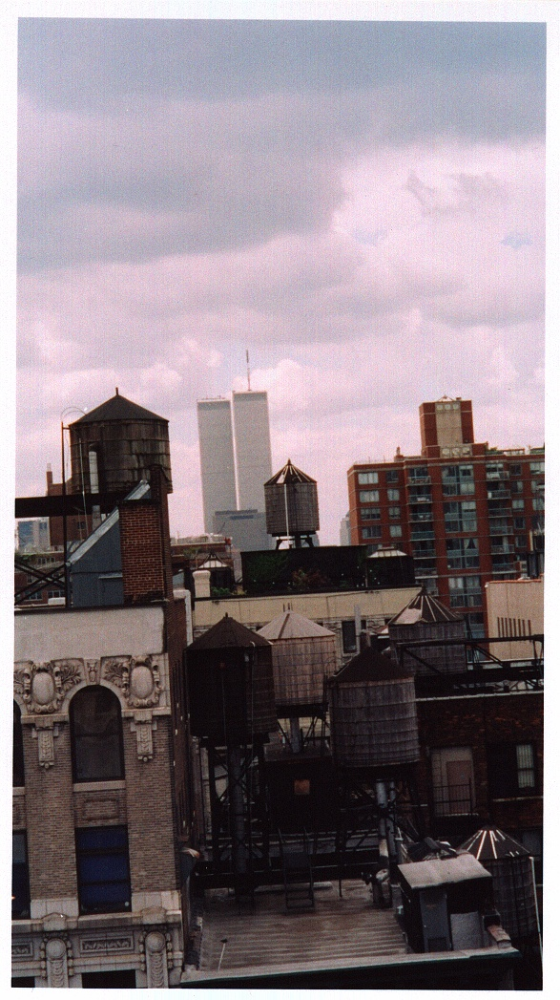

A lot of people thought the Twin Towers were ugly: nondescript buildings that were remarkable only because they were tall.

I loved them.

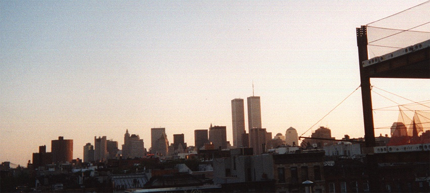

I was impressed by their pure height and power. I remember my first trip to New York from Philadelphia when I was five, six or perhaps seven years old. I stood near the base of the towers, looked at the vertical lines of their facades and followed them upward as far as I could.

I visited the observation deck at the top and was overwhelmed by the scale of it all.

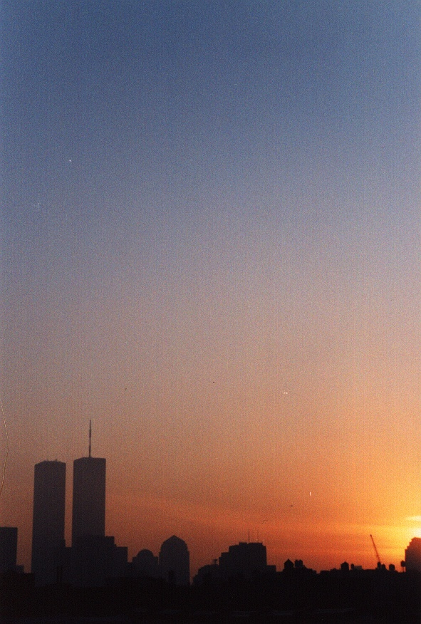

Growing up in Philadelphia, I was a little jealous that our city did not have buildings like them. New York seemed to possess an entirely different kind of skyline.

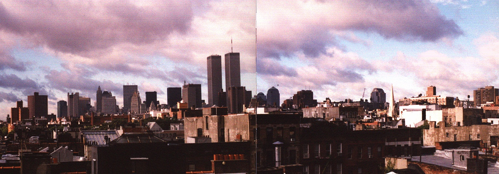

Even after I moved to the city, the towers never became ordinary to me. I continued photographing them.

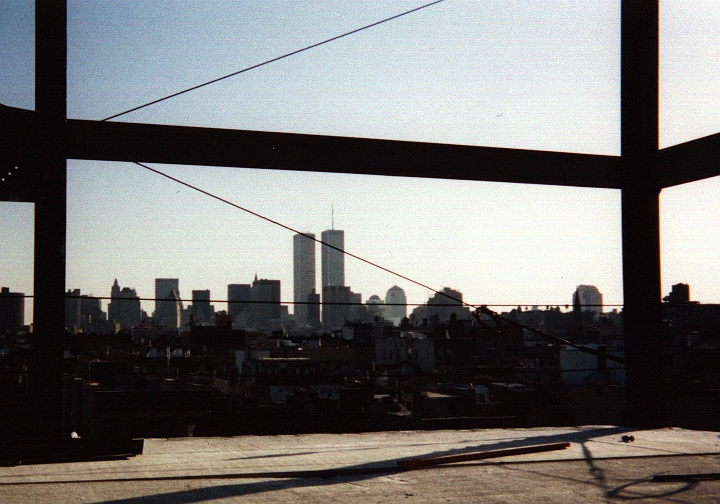

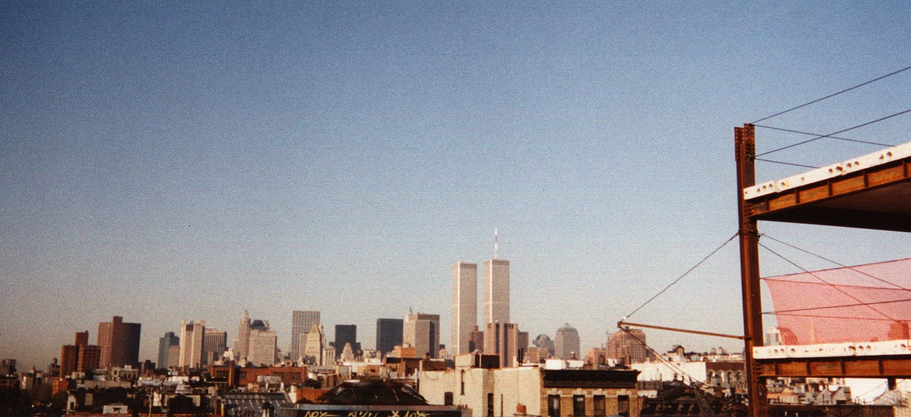

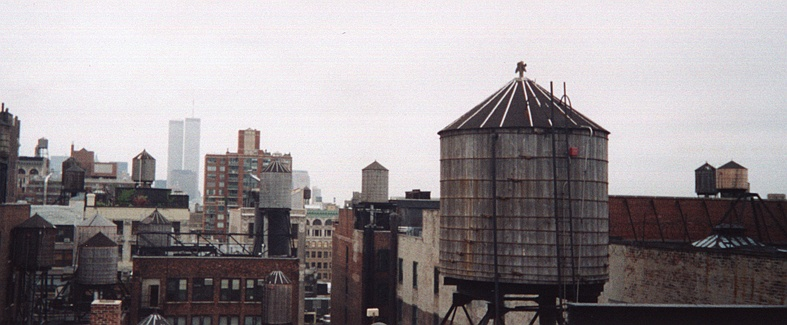

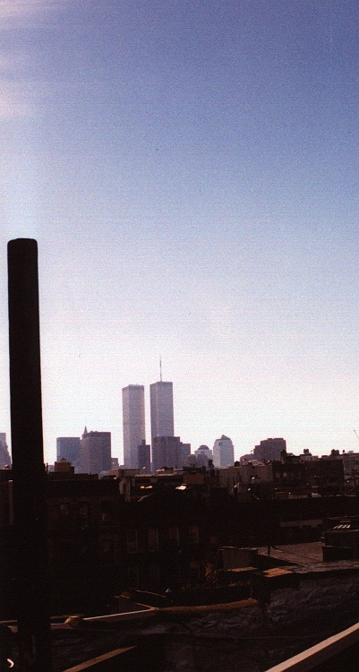

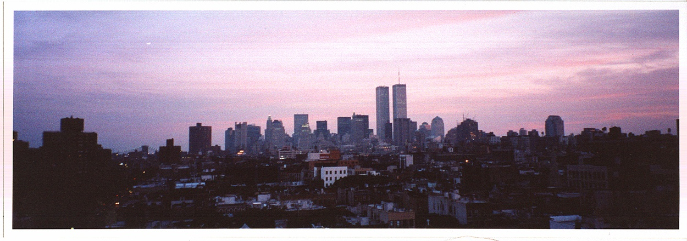

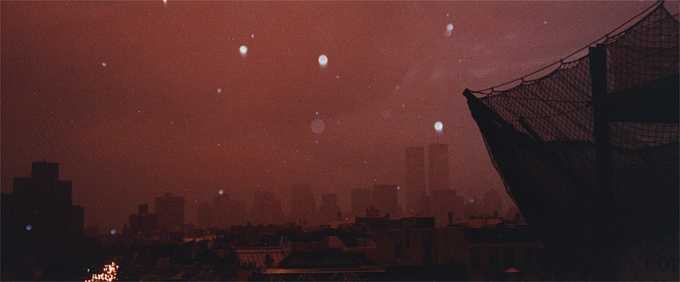

The photographs accompanying this essay include some of those earlier ones alongside the pictures I took from my roof on September 11. I wanted to include both.

These are not only photographs of destruction. They are photographs of buildings I admired, a city I lived in and a morning that divided one period of my life from another.

Twenty-five years later, I still look at them to remind myself of the reality of what happened, and of the towers as they existed before that day.

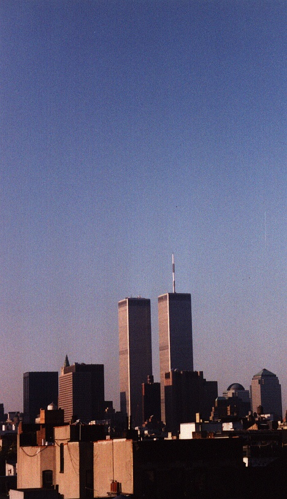
