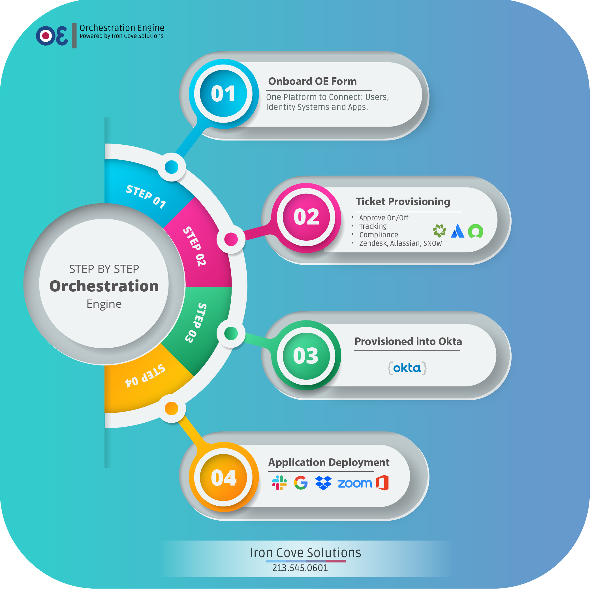

+++
title = 'Ironcove Solutions Orchestration Engine'
date = 2024-03-05T14:00:47-08:00
# draft = true
tags = [
  "workforce-onboarding",
  "api-integration",
  "okta",
  "zendesk",
  "product-development",
  "automation"
]
# https://www.benstrawbridge.com/projects/ironcove-orchestration-engine/
aliases = ["/projects/ironcove-orchestration-engine/"]
# weight = 10
# homeFeature = true
homeFeatureIcon = "fas fa-code-compare"
homeFeatureTitle = "IronCove Solutions OE"
# homeFeatureSummary = "Ironcove Solutions’ Orchestration Engine revolutionizes workforce onboarding with seamless API integration, customizable forms, and automated processes, enhancing efficiency and user experience in collaboration with Ironcove Solutions."
showTOC = true
+++

## Workforce Onboarding: A Case Study of Ironcove Solutions' Orchestration Engine

I was hired by [Ironcove Solutions](https://ironcovesolutions.com/) to lead product development for a new application they were developing called the [Orchestration Engine](https://ironcovesolutions.com/blog/zendesk-to-okta-as-an-onboarding-process/), an application designed to streamline workforce onboarding processes. We collaborated closely with the team from Ironcove Solutions to bring their vision to life.

<!--more-->

### Project Overview:

The Orchestration Engine was conceptualized as a comprehensive solution to simplify the onboarding and offboarding of employees and contractors for diverse projects. Integrating seamlessly with three key APIs - Okta, Zendesk, and our internal OE API - the application aimed to empower company administrators with control and efficiency.

### Technical Implementation

The project began with the integration of the Zendesk API, where we developed a custom JWT client to manage client-side tokens, ensuring secure authentication. Leveraging this integration, administrators gained access to a versatile form within the Orchestration Engine, facilitating the onboarding process for individual employees or entire teams through a convenient CSV upload tool.

Central to the Orchestration Engine's functionality is its flexibility. By dynamically configuring form fields and values based on parameters retrieved from Zendesk, administrators could tailor the onboarding experience to their specific needs. Additionally, seamless communication with the Okta API enabled real-time validation of user emails and deployment of the end-user application suite, enhancing user experience and security.

To ensure data integrity, we implemented an email validation tool that cross-referenced company email addresses with Okta's database, guaranteeing uniqueness and mitigating potential conflicts. Administrators were empowered to select and configure applications for automatic deployment via Okta, further streamlining the onboarding process.

Upon submission of the Orchestration Engine form, the application orchestrated a series of actions behind the scenes. Each user's onboarding triggered the creation of individual tracking tickets in Zendesk and the provisioning of a new user in Okta. Subsequently, Okta's automated welcome email signaled successful onboarding, closing the loop in a seamless, efficient manner.

### Conclusion:

Our collaboration with Ironcove Solutions on the Orchestration Engine exemplifies the transformative potential of innovative technology solutions. By leveraging the power of APIs and cutting-edge development techniques, we have created a tool which simplifies the workflow and eases the tedious task of employee onboarding and offboarding.
